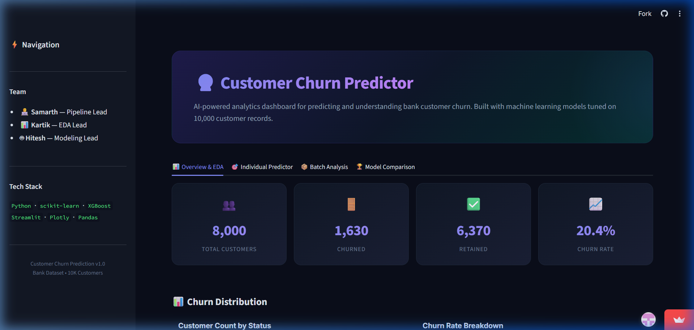
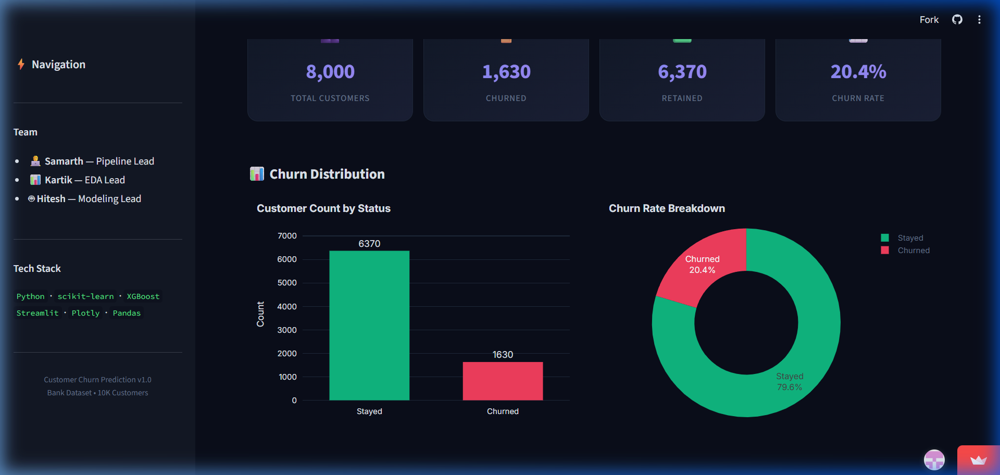
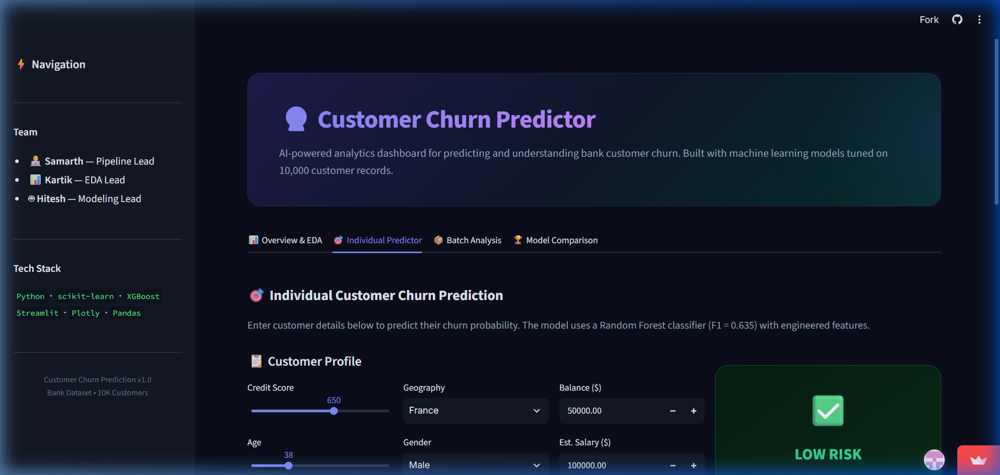
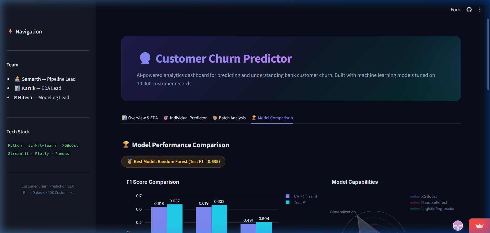

# Customer Churn Prediction

A machine learning project that predicts bank customer churn using the Kaggle Bank Customer Churn Dataset (10,000 customers, 18 features). The project includes comprehensive EDA, a custom feature engineering pipeline, model tuning via GridSearchCV, and a production-ready interactive Streamlit dashboard for real-time churn prediction.

## Screenshots

### Dashboard Overview & EDA


### Interactive EDA Charts


### Individual Customer Churn Predictor


### Model Comparison


## Hosted URL

🔗 **Live Dashboard:** [https://customer-churn-prediction-i.streamlit.app/](https://customer-churn-prediction-i.streamlit.app/)

## Features Implemented

### Frontend
- Premium dark-themed interactive dashboard built with Streamlit & Plotly
- Hero banner with gradient design and team credits in sidebar
- KPI metric cards (Total Customers, Churned, Retained, Churn Rate)
- Interactive Plotly charts for churn distribution, geographic breakdown, and segment analysis
- Individual customer churn prediction form with sliders, dropdowns, and real-time probability gauge
- Batch prediction via CSV upload with downloadable results
- Model comparison page with performance metrics and visualizations

### Backend
- Streamlit server with session state management
- Preprocessing pipeline serialized with joblib for inference
- Feature engineering applied automatically on user input before prediction
- Batch processing engine for CSV-based bulk predictions

### Machine Learning
- **Model:** XGBoost Classifier (best), Random Forest, Logistic Regression — all tuned via GridSearchCV (5-fold CV, F1-scored)
- **Predicts:** Whether a bank customer will churn (leave) or stay, outputting a churn probability percentage
- **Best Test F1 Score:** 0.637 (XGBoost)
- **Feature Engineering:** 6 custom features derived from EDA insights — `AgeBucket`, `BalanceToSalaryRatio`, `IsGermany`, `ZeroBalance`, `InactiveProducts`, `HighValueAtRisk`
- **Pipeline Integration:** A sklearn `Pipeline` with `EDAFeatureEngineer` → `ColumnTransformer` (OneHotEncoder + StandardScaler) preprocesses raw customer data before model inference. The pipeline and trained model are serialized as `.joblib` files and loaded by the dashboard for real-time predictions.
- **Class Imbalance Handling:** `class_weight='balanced'` (LR, RF) and `scale_pos_weight` (XGBoost)
- **Evaluation:** F1 score computed using `f1_score(y_test, model.predict(X_test))` with default 0.5 threshold

## Technologies/Libraries/Packages Used

- **Frontend:** Streamlit, Plotly, HTML/CSS (custom dark theme with glassmorphism)
- **Backend:** Python, Pandas, NumPy, Joblib
- **Machine Learning:** scikit-learn (Pipeline, ColumnTransformer, GridSearchCV, StandardScaler, OneHotEncoder, LogisticRegression, RandomForestClassifier), XGBoost, Matplotlib, Seaborn

## Local Setup

1. **Clone the repository:**
   ```bash
   git clone https://github.com/samarth-7-cpu/customer-churn-prediction.git
   cd customer-churn-prediction
   ```

2. **Install dependencies:**
   ```bash
   pip install -r requirements.txt
   ```

3. **Download the dataset** from [Kaggle](https://www.kaggle.com/datasets/radheshyamkollipara/bank-customer-churn) and place it as `data/raw-bank-churn.csv`.

4. **Run the data split:**
   ```bash
   python src/split_data.py --input data/raw-bank-churn.csv --output-dir data
   ```

5. **Run the preprocessing pipeline:**
   ```bash
   python src/preprocessing_pipeline.py --verify
   ```

6. **Train models:**
   ```bash
   python src/model_training.py --verify
   ```

7. **Launch the dashboard:**
   ```bash
   streamlit run dashboard.py
   ```
   Open [http://localhost:8501](http://localhost:8501) in your browser.

## Team Members

- **Samarth** — Pipeline Lead (preprocessing, feature engineering, train/test split)
- **Kartik** (techykartik07) — EDA Lead (exploratory analysis, visualizations)
- **Hitesh** (hiteshchandra2703-cloud) — Modeling Lead (model training, evaluation, final F1 score)
